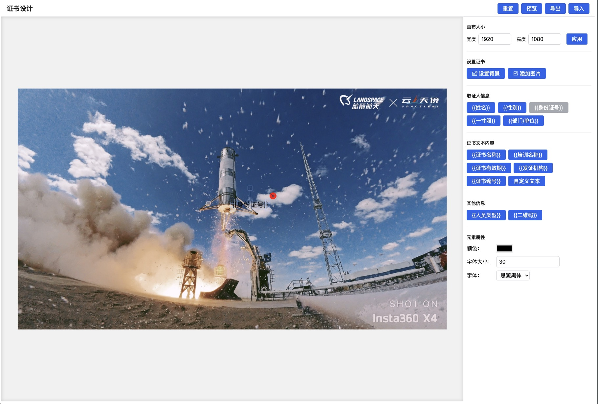
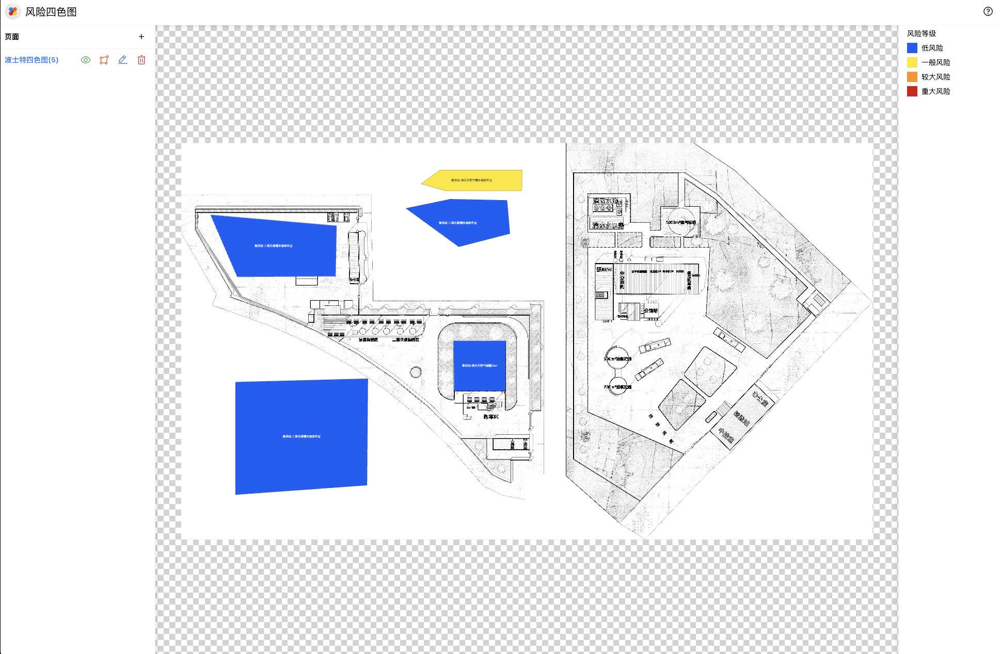

# Certificate Design Project

## Project Title

Certificate Design Tool




## Project Description

This project aims to provide a user-friendly certificate design tool that allows users to customize and create personalized certificates. The tool supports various features, including reset, preview, import/export, and is designed to help users easily create and manage certificates.

## Branches

- **tp-ui**: This branch includes all features of the certificate design tool, providing a comprehensive solution for users.
- **bst-ui**: This branch is another Fabric.js application project that allows users to draw areas on images, showcasing different functionalities.

## Technology Stack

- **Nuxt 3**: A powerful framework based on Vue.js that enables server-side rendering and static site generation, providing an intuitive development experience.
- **Fabric.js@5**: A JavaScript library for working with HTML5 canvas, allowing for rich interactive graphics and easy manipulation of objects on the canvas.

## Features

- **Reset/Preview/Import/Export**: Simulates save and retrieve functionality.
- **Canvas Size Setting**: Users can adjust the canvas size according to their needs.
- **Set Certificate Background**: Choose or customize the background of the certificate.
- **Support Custom Images**: Users can upload their own images as part of the certificate.
- **Certificate Template Text Information**: Provides preset text information for users to choose from.
- **Custom Text Information**: Allows users to input and edit their own text information.
- **Font Customization**: Customize the color, font size, and style for individual text elements.

## Installation and Running

1. Clone the project to your local machine:
   ```bash
   git clone https://github.com/lanseria/fabricjs-editor-nuxt-demo
   ```
2. Navigate to the project directory:
   ```bash
   cd fabricjs-editor-nuxt-demo
   ```
3. Install dependencies (if any):
   ```bash
   pnpm install
   ```
4. Start the application:
   ```bash
   pnpm dev
   ```

## How to Use the Project

1. Open the application and select the canvas size.
2. Set the background and upload custom images.
3. Input certificate template text information and custom text information.
4. Adjust font color, size, and style as needed.
5. Use the "Preview" feature to view the final effect and make adjustments if necessary.
6. Once completed, you can choose to export the certificate or save the project.

## License

This project is licensed under the MIT License. For more details, please refer to the LICENSE file.

## Contact Information

If you have any questions or suggestions, please contact me at: [zhangchao564265135@hotmail.com].

## Language Switch

You can switch between Chinese and English README files at this link: [中文](./README.CN.md)

Citations:
https://www.freecodecamp.org/news/how-to-write-a-good-readme-file/
